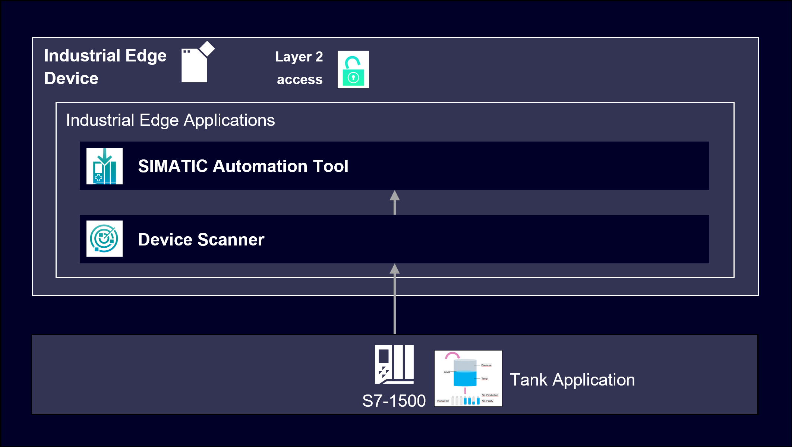

# SIMATIC Automation Tool application example
This example shows how to use the Industrial Edge App “SIMATIC Automation Tool”.
- [SIMATIC Automation Tool Application Example](#simatic-automation-tool-application-example)
  - [Description](#description)
    - [Overview](#overview)
    - [General Task](#general-task)
  - [Requirements](#requirements)
    - [Prerequisites](#prerequisites)
    - [Used Components](#used-components)
    - [TIA Project](#tia-project)
  - [Configuration Steps](#configuration-steps)
  - [Usage](#usage)
  - [Documentation](#documentation)
  - [Contribution](#contribution)
  - [Licence and Legal Information](#licence-and-legal-information)

## Description
### Overview
This document describes how to scan the network and display all devices with detailed information within the Industrial Edge environment.

### General Task
This example scans the network for compatible devices and displays their information in the SIMATIC Automation Tool app. The selected PLC is then switched from STOP to RUN mode. Afterwards the IP address is changed. The last step describes the procedure of commissioning a firmware update on the selected PLC.

## Requirements
### Prerequisites
- Access to an Industrial Edge Management System (IEM)
- Onboarded or "Ready-To-Onboard" Industrial Edge Device
- Installed Apps: Device Scanner DCP Service (requires layer 2 network settings), Device Scanner IP Service, SIMATIC Automation Tool
- Edge device is connected to the PLC
- Google Chrome (Version ≥ 72) or Firefox (Version ≥ 62)

### Used Components
- Industrial Edge Management (IEM) V1.15.10 
- Device Scanner IP Service V1.3.0
- Device Scanner DCP Service V1.3.0
- SIMATIC Automation Tool 1.4.0
- Industrial Edge virtual Device V1.14.1-1-b
- S7-1511
- Web browser (Mozilla or Chrome)

### TIA Project
The used TIA Portal project to demonstrate starting and stopping of the PLC can be found in the [miscellenous](https://github.com/industrial-edge/miscellaneous) repository:
- [TIA Tank Application](https://github.com/industrial-edge/miscellaneous/blob/main/tank%20application/tia-tank-application.zap16)

## Configuration Steps
The following configuration steps are required in order to set up this example. Further information about these steps can be found in the [docs](docs/Installation.md).
- [Configure Device Layer 2 access](docs/Installation.md#configure-device-layer-2-access)
  - [During onboarding](docs/Installation.md#during-onboarding)
  - [After onboarding](docs/Installation.md#after-onboarding)

Since the Device Scanner DCP Service can only be installed once a layer 2 network has been configured, all mandatory apps can only be installed once the configuration steps above were persued.

## Usage
Once the layer 2 network has been set up and all required apps are installed, the user can open the SIMATIC Automation Tool to scan the network, display, start and stop the PLC's and update the firmware. These features are described in the [docs](docs/Usage.md).
- [Menu Bar](docs/Usage.md#menu-bar)
- [Scan Network](docs/Usage.md#scan-network)
- [Firmware Update](docs/Usage.md#firmware-update)

## Documentation
You can find further documentation and help in the following links:
  - [Industrial Edge Hub](https://iehub.eu1.edge.siemens.cloud/#/documentation)
  - [Industrial Edge Forum](https://www.siemens.com/industrial-edge-forum)
  - [Industrial Edge landing page](https://new.siemens.com/global/en/products/automation/topic-areas/industrial-edge/simatic-edge.html)
  
## Contribution
Thank you for your interest in contributing. Anybody is free to report bugs, unclear documentation, and other problems regarding this repository in the Issues section.
Additionally everybody is free to propose any changes to this repository using Pull Requests.

If you haven't previously signed the [Siemens Contributor License Agreement](https://cla-assistant.io/industrial-edge/) (CLA), the system will automatically prompt you to do so when you submit your Pull Request. This can be conveniently done through the CLA Assistant's online platform. Once the CLA is signed, your Pull Request will automatically be cleared and made ready for merging if all other test stages succeed.

## Licence and Legal Information
Please read the [Legal information](LICENSE.md).
