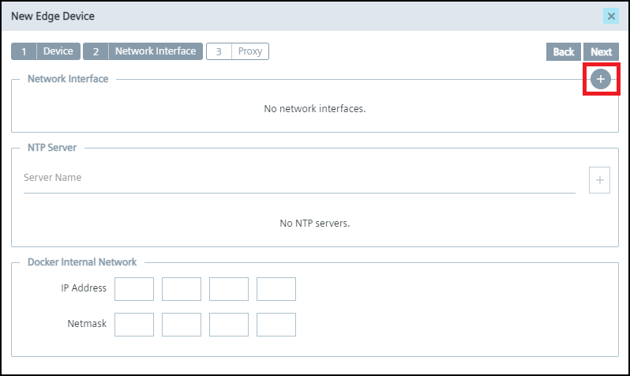
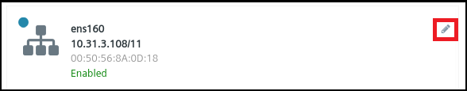
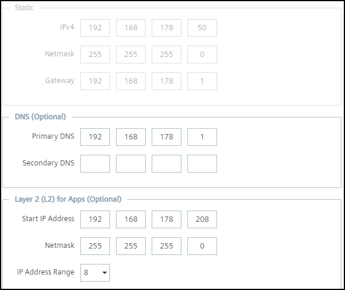
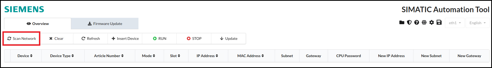
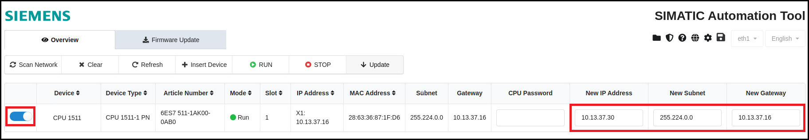
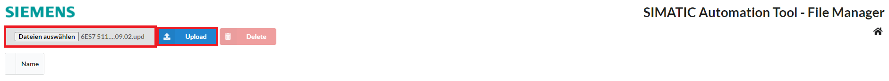
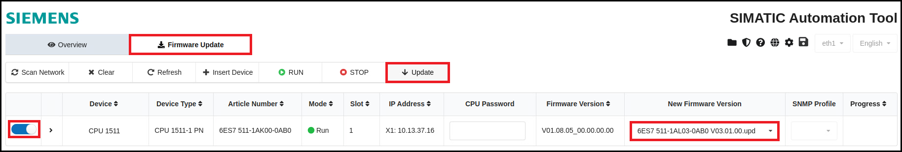

# Configuration
- [Configuration](#configuration)
  - [Configure Device Layer 2 access](#configure-device-layer-2-access)
  - [Configure SIMATIC Automation Tool](#configure-simatic-automation-tool)
    - [Scan Overview](#scan-overview)
    - [Firmware Update](#firmware-update)
    - [Program Update](#program-update)

## Configure Device Layer 2 access
The device scanner requires layer 2 access to be able to scan the network for devices.

You can configure the Layer 2 access either during the onboarding of the device through the management or later on directly on the edge device.

### During onboarding
1. To onboard a new device with layer 2 network access click on "+ New Edge Device" on the upper right side.

2. Configure your Edge Device and click on "Next" to get to the network settings.

3. Click on the "+" button at the top right to configure the network interface.   

4. Configure the network interface and the layer 2 access and click on "add".   

4. Confirm the device configuration with "Next" and with "Create".

### After onboarding
1. To adjust the layer 2 network after the creation of the device navigate to "Settings" and "Connectivity" on your edge device and click on "LAN network".

2. Click on the edit symbol of the network interface.      

3. Configure the network interface and the layer 2 access.   

3. Apply the changes by clicking on "Update".

## Configure SIMATIC Automation Tool
The Industrial Edge Device is limited to one L2 network interface only. Therefore only this interface can be used for the SIMATIC Automation Tool. It is named "eth1" and can't be changed.   

### Scan Overview
The SIMATIC Automation Tool can be used to scan your network and adjust some settings of your devices.

1. On the left bar click on the button "Scan Network" to start the scan of the network.   

   You can also add a device manually by clicking on "Insert Device" and enter either an IP or MAC address of the device.
   

2. After the network has been scanned, you can see the devices in the SIMATIC Automation Tool.
Now you can select the PLC with the left switch and click on the button "STOP" or "START" to stop or start the PLC.   

3. Select the PLC and enter a new IP address, network mask or gateway address.   

4. Click the "Update" button to set the new addresses.   

### Firmware Update
You can use the SIMATIC Automation Tool application to update the firmware of your device.

The latest firmware version for the S7-1500 PLC can be downloaded on the SIOS web page [firmware update S7-1500](https://support.industry.siemens.com/cs/document/109478459/firmware-update-s7-1500-cpus-incl-displays-and-et-200-cpus-(et-200sp-et-200pro)?lc=en-pe).

To update the firmware version, follow these steps:

1. Select the file manager at the top right corner.   

2. Click on "Choose Files" in the upper left corner, select the current firmware version and click on "Upload".   

   The uploaded files are shown in the file list and can now be used to update the PLC.

3. Go back to the main window of thew SIMATIC Automation Tool.
   - Click on "Firmware Update" on the upper left corner.
   - Select the PLC with the left switch button.
   - Select in the column "New Firmware Version" the new uploaded firmware.   
   - Click on "Update" on the upper left corner.

   