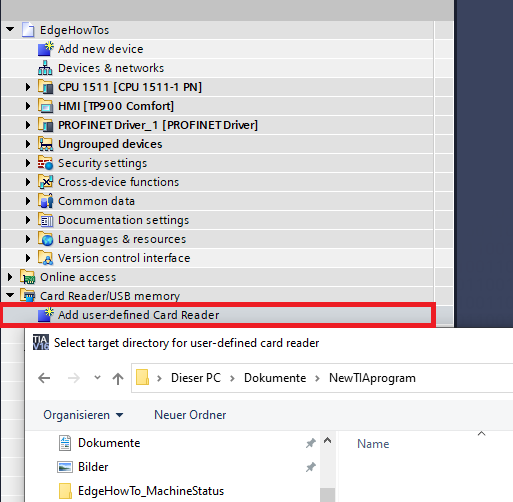
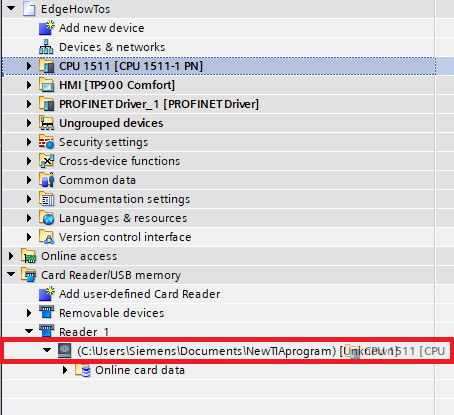
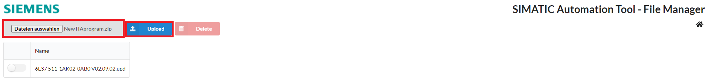
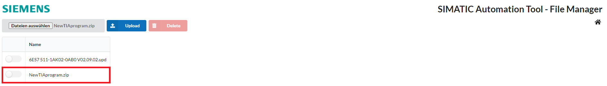
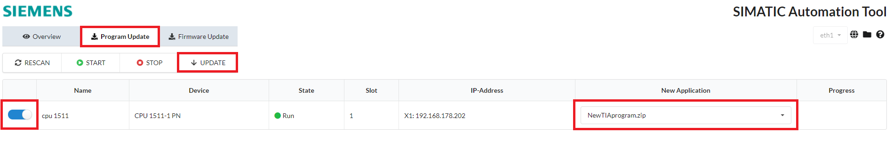

# Configuration

- [Configuration](#configuration)
  - [Configure Device Layer 2 access](#configure-device-layer-2-access)
  - [Configure SIMATIC Automation Tool](#configure-simatic-automation-tool)
    - [Scan Overview](#scan-overview)
    - [Firmware Update](#firmware-update)
    - [Program Update](#program-update)

## Configure Device Layer 2 access

The device scanner requires a layer 2 access to enable the scanner of the devices in the Machine Insight.

Hint: Layer 2 access can only be configured for a new device, not later.

Open the management system and select "My Edge Devices" on the left side in the bar.

Click on "+ New Edge Device" on the upper right side.

Configure your Edge Device and click on "Next".

Click on the "+" button at the top right to configure the network interface.

Configure the network interface and the layer 2 access and click on "add".

Confirm the device configuration with "Next" and with "Create".

## Configure SIMATIC Automation Tool

Due to limitation in the industrial edge device of using L2 access only for one interface the used interface for the Automation Tool is bounded to that one.
The interface 'eth1' can therefore not be changed.

### Scan Overview

On the left bar click on the button "RESCAN" to starting the scan of the network.

After the network has been scanned, you can see the PLC in SIMATIC Automation Tool.

Now you can select the PLC with the left switch and click on the button "STOP" or "START" to stop or start the PLC.

Select the PLC and enter a new IP-Address, network mask or gateway address.

Click the "UPDATE" button to set the new addresses.

### Firmware Update

You can use the SIMATIC Automation Tool App to update the current or latest firmware version on your PLC.

The latest firmware version for the S7-1500 PLC can be download on the SIOS web page [firmware update S7-1500](https://support.industry.siemens.com/cs/document/109478459/firmware-update-s7-1500-cpus-incl-displays-and-et-200-cpus-(et-200sp-et-200pro)?lc=en-pe)

To update the firmware version, select the File Manager at the top right corner.

click on "select file" in the upper left corner, select the current firmware version and click on "Upload".

Uploaded file are shown in the file list and can now be used to update the PLC.

Go back to the main window of SIMATIC Automation Tool.

- Click on "Firmware Update" on the upper left corner
- Select the PLC with the left switch button
- Select in "New Firmware" the new uploaded firmware
- Click on "UPDATE" on the upper left corner

### Program Update

You can use the SIMATIC Automation Tool App to update your TIA Portal with a new program file.

A new program file can be provided by using the TIA Portal software.

First a target directory needs to be defined to store the program file locally.

Drag & Drop the desired PLC to the new created card reader to make a download the local folder. 

Just zip the two created files of the store.

Upload the zip folder in the file manager and press the "Upload" button.

After the upload the program is listed.

Go back to the main window of SIMATIC Automation Tool.

- Click on "Program Update" on the upper left corner
- Select the PLC with the left switch button
- Select in "New Application" the new uploaded application
- Click on "UPDATE" on the upper left corner

