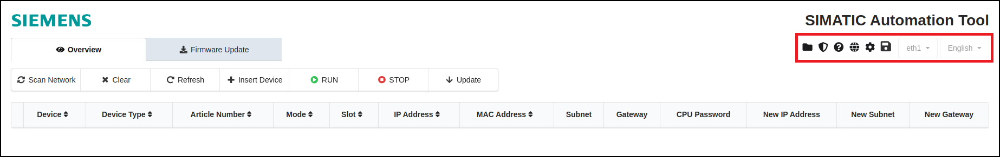
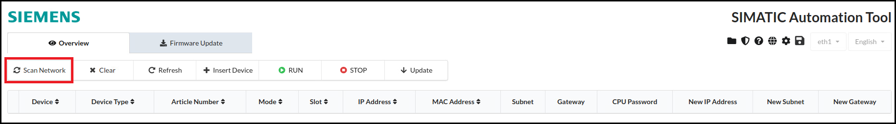
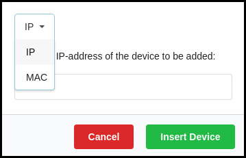
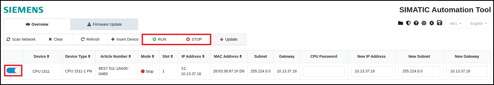
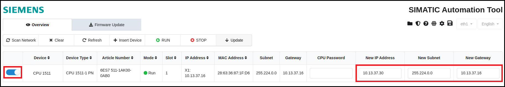
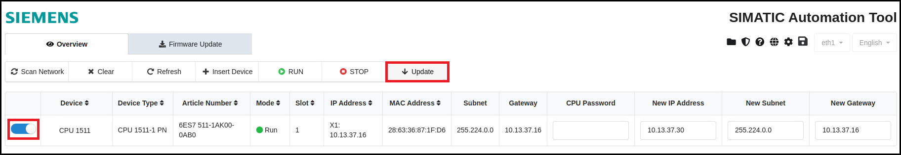
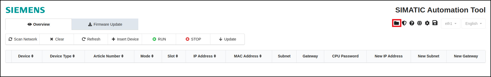
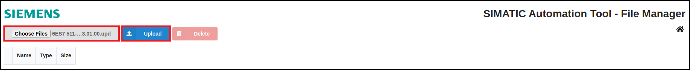
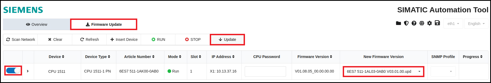

# Usage
- [Menu Bar](#menu-bar)
- [Scan Network](#scan-network)
- [Firmware Update](#firmware-update)

## Menu Bar
The SIMATIC Automation Tool provides some settings and views in the menu bar at the top right hand corner. The icons will be described below starting from the left:

**File Manager:** The file manager allows the user to upload files that are required to perform firmware updates. No other files can be uploaded here.

**Certificate Manager:** With the certificate manager the user can trust or untrust devices and delete or import certificates for specific devices.

**Help:** By clicking on the question mark symbol a small window pops up. Here the user can open the user guide or the device catalog showing compatible devices.

**Open Source Software:** In order to get some information about the used open source software the user can click on the globe symbol.

**Settings:** By clicking on the gear icon the user can find some general information about the application itself. Additionally, the SNMP profiles that are required to update the firmware of SCALANCE devices can be added here.

**Export Device Information:** By clicking on the save icon the user can export information about either all or only selected devices.
 
**Network Interface and Language:** At the right side of the menubar the selected network interface and language can be seen. Currently the Industrial Edge Device is limited to one layer 2 network interface only and therefore only this interface can be used for the SIMATIC Automation Tool. It is named "eth1" and can't be changed. Also the language can't be changed as of now.

## Scan Network
The SIMATIC Automation Tool can be used to scan your network and adjust some settings of your devices.

1. On the left bar click on the button "Scan Network" to start the scan of the network.   

   You can also add a device manually by clicking on "Insert Device" and enter either an IP or MAC address of the device.
   

2. After the network has been scanned, you can see the devices in the SIMATIC Automation Tool.
Now you can select the PLC with the left switch and click on the button "STOP" or "RUN" to stop or start the PLC.   

3. Select the PLC and enter a new IP address, network mask or gateway address.   

4. Click the "Update" button to set the new addresses.   

## Firmware Update
You can use the SIMATIC Automation Tool application to update the firmware of your device.

The latest firmware version for the S7-1500 PLC can be downloaded on the SIOS web page [firmware update S7-1500](https://support.industry.siemens.com/cs/document/109478459/firmware-update-s7-1500-cpus-incl-displays-and-et-200-cpus-(et-200sp-et-200pro)?lc=en-pe).

To update the firmware version, follow these steps:

1. Select the file manager at the top right corner.   

2. Click on "Choose Files" in the upper left corner, select the downloaded firmware version and click on "Upload".   

   The uploaded files are shown in the file list and can now be used to update the PLC.
   
   Note: Only update files can be uploaded to the file manager.

3. Go back to the main window of the SIMATIC Automation Tool by clicking on the home symbol on the right.
   - Click on "Firmware Update" at the top.
   - Select the PLC with the switch button on the left.
   - Select the uploaded firmware in the column "New Firmware Version"
   - Click on "Update".

   